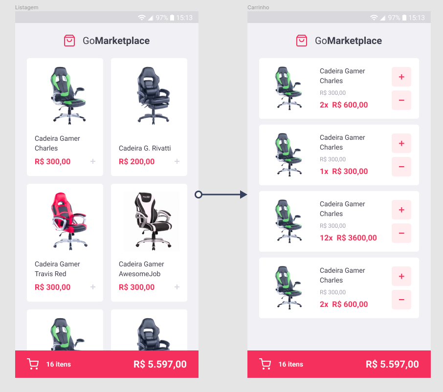

<h1 align="center">Desafio 08: Fundamentos do React Native</h1>
<p align="center">
  
</p>


<p align="center">
  

  <a href="license.md">
  
  </a>
</p>

___

<h3 align="center">
  <a href="#information_source-sobre">Sobre</a>&nbsp;|&nbsp;
  <a href="#rocket-tecnologias-frameworks-dependencias">Tecnologias</a>&nbsp;|&nbsp;
  <a href="#licença">Licença</a>
</h3>

___

<br>

## :information_source: Sobre

<br>

Desenvolvimento de uma nova aplicação, a GoMarketplace.

Serão utilizados os conceitos aprendidos até agora no React Native junto com o TypeScript, utilizando rotas, Async Storage e a Context API.

<br>

## :pushpin: Utilizando uma fake API

<br>

Antes de tudo, para que se tenha os dados para exibir em tela, foi criado um arquivo que poderá utilizar como fake API para te prover esses dados.

O arquivo `server.json` contém os dados para uma rota `/products`. Para executar esse servidor você pode executar o seguinte comando:

```bash
  yarn json-server server.json -p 3333
```
Caso esteja utilizando o emulador android, rodar do comando identificando o `ip` da máquina

```bash
  yarn json-server --host xxx.xxx.xxx.xxx server.json -p 3333
```

## :pushpin: Layout da aplicação

<br>

<p align="center">
  
</p>

<br>

## :pushpin: Funcionalidades da aplicação

<br>

- **`Listar os produtos da fake API`**: Sua página `Dashboard` deve ser capaz de exibir uma listagem através de uma tabela, com os campos `title`, `image_url` e `price`.

**Dica**: Você pode utilizar a função [Intl](https://developer.mozilla.org/pt-BR/docs/Web/JavaScript/Reference/Global_Objects/NumberFormat) para formatar os valores. Dentro da pasta `utils` no template você encontrará um código para te ajudar.

- **`Adicionar itens ao carrinho`**: Em toda sua aplicação, você deve utilizar o Contexto chamado `cart` que deixamos disponível. Você vai precisar completar as funcionalidades dentro de `hooks/cart.tsx` para que você consiga adicionar itens ao carrinho.

**Dica**: No seu contexto de carrinho, utilize uma propriedade chamada `quantity` para controlar quantos desse item existem no seu carrinho.

**Dica 2**: Caso um produto que você está adicionando já exista no carrinho, apenas altere a quantidade dele no seu contexto para evitar itens duplicados.

- **`Exibir itens do carrinho`**: Na página `Cart` você deve exibir todos os itens do carrinho, junto com a quantidade, valor único, valor subtotal dos itens e total de todos os items.

- **`Aumentar quantidade de itens do carrinho`**: Na página `Cart` você deve permitir que o usuário aumente a quantidade de itens do mesmo produto, para isso você pode utilizar a função `increment` dentro do seu contexto em `/src/hooks/cart.tsx`.

- **`Diminuir quantidade de um item do carrinho`**: Na página `Cart` você deve permitir que o usuário decremente a quantidade de itens do mesmo produto, para isso você pode utilizar a função `decrement` dentro do seu contexto em `/src/hooks/cart.tsx`.

- **`Exibir valor total dos itens no carrinho`**: Tanto na página `Dashboard`, quanto na página `Cart` você deve exibir o valor total de todos os itens que estão no seu carrinho.

<br>

## :pushpin: Específicação dos testes

<br>

Para esse desafio, temos os seguintes testes:

- **`should be able to list the products`**: Para que esse teste passe, sua aplicação deve permitir que sejam listados na sua tela `Dashboard`, todos os produtos que são retornadas do Fake API. Essa listagem deve exibir o `title` e o `price` que deve ser formatado utilizando a função `Intl`.

- **`should be able to add a product to the cart`**: Para que esse teste passe, você deve permitir que seja possível adicionar produtos da sua `Dashboard` ao carrinho, utilizando o contexto de `cart` disponibilizado.

- **`should be able to list the products on the cart`**: Para que esse teste passe, você deve permitir que seja possível listar os produtos que estão salvos no contexto do seu carrinho na página `Cart`, nessa página exiba o nome do produto e o subtotal total de cada produto (price \* quantity).

- **`should be able to calculate the cart total`**: Para que esse teste passe, tanto na página `Dashboard`, tanto na página `Cart` você deve exibir o valor total de todos os itens que estão no seu carrinho.

**Dica**: Para calcular o total de todos os itens, você pode utilizar o [reduce](https://developer.mozilla.org/pt-BR/docs/Web/JavaScript/Reference/Global_Objects/Array/reduce) para somar todos os valores e retornar o valor total.

- **`should be able to show the total quantity of itens in the cart`**: Para que esse teste passe, tanto na página `Dashboard`, tanto na página `Cart` você deve exibir o número total de itens que estão no seu carrinho.

**Dica**: Para calcular o total de todos os itens, você pode utilizar o [reduce](https://developer.mozilla.org/pt-BR/docs/Web/JavaScript/Reference/Global_Objects/Array/reduce) para somar todos os valores e retornar o valor total.

**Dica 2**: Utilize o useMemo para armazenar o valor total do carrinho que você calculou.

- **`should be able to increment product quantity on the cart`**: Para que esse teste passe, você deve permitir que seja possível incrementar a quantidade de um produto do seu carrinho, utilizando o contexto de `cart` disponibilizado.

- **`should be able to decrement product quantity on the cart`**: Para que esse teste passe, você deve permitir que seja possível decrementar a quantidade de um produto do seu carrinho, utilizando o contexto de `cart` disponibilizado.

**Dica**: Ao decrementar a quantidade de um produto, não permita que ele seja decrementado para um valor negativo, sendo a quantidade mínima 1 para estar no carrinho.

- **`should be able to navigate to the cart`**: Para que esse teste passe, no seu componente `FloatingCart` na Dashboard, você deve permitir que ao clicar no botão de carrinho com o testID de `navigate-to-cart-button`, o usuário seja redirecionado para a página `Cart`.

- **`should be able to add products to the cart`**: Para que esse teste passe, no seu arquivo onde contém o contexto do carrinho, você deve permitir que a função `addToCart` adicione um novo item ao carrinho.

- **`should be able to increment quantity`**: Para que esse teste passe, no seu arquivo onde contém o contexto do carrinho, você deve permitir que a função `increment` incremente em `1` unidade a quantidade de um item que está armazenado no contexto.

- **`should be able to decrement quantity`**: Para que esse teste passe, no seu arquivo onde contém o contexto do carrinho, você deve permitir que a função `decrement` decremente em `1` unidade a quantidade de um item que está armazenado no contexto.

- **`should store products in AsyncStorage while adding, incrementing and decrementing`**: Para que esse teste passe, no seu arquivo onde contém o contexto do carrinho você deve permitir que todas as atualizações que você fizer no carrinho, sejam salvas no AsyncStorage. Por exemplo, ao adicionar um item ao carrinho, adicione-o também no AsyncStorage. Lembre de também atualizar o valor do AsyncStorage quando você incrementar ou decrementar a quantidade de um item.

- **`should load products from AsyncStorage`**: Para que esse teste passe, no seu arquivo onde contém o contexto do carrinho, você deve permitir que todos os produtos que foram adicionados sejam buscados do AsyncStorage.

<br>

## :rocket: Tecnologias, Frameworks e Dependências

- [ReactJs](https://pt-br.reactjs.org/)
- [TypeScript](https://www.typescriptlang.org/)
- [React Native](https://reactnative.dev/)
- [Json Server](https://www.npmjs.com/package/json-server)
- [React Native Async Storage](https://github.com/react-native-async-storage/async-storage)

<br>

## Licença

Esse projeto está sob a licença MIT. Veja o arquivo [LICENSE](LICENSE) para mais detalhes.
